# 《Cometric Tools for Computer Graphics》读书笔记

## C1.绪论

1.浮点数屏蔽问题

非负浮点数求和应该按从小到大的顺序进行，以避免大数屏蔽小数。

## C2.矩阵和线性系统

### 多元组

多元组本质上就是一个元素的有序序列，n 个元素的多元组称为 n 维多元组，并用下标来标记：`a = (a1, a2, ..., an)`。

多元组的相加（或相减，相乘，相除）可以简单地将它们对应的元素相加（或相减，相乘，相除）实现。

多元组的乘法，就是将每一项相乘后求和。结果是一个数，所以叫做**数量积**，也叫做**点积**。两个多元组 **a** 和 **b** 的点积记作 **a·b**。具有以下性质：

- 交换性：a·b = b·a
- 结合性：(ka)·b = k(a·b)
- 分配性：a·(b + c) = a·b + a·c

### 矩阵

矩阵用大写粗体字母表示，用 "m 行 n 列" 来说明矩阵的大小，表示为 m x n。如果 m = n，则矩阵为方阵。


#### 1.转置矩阵（transpose of matrix）

转置矩阵的生成方式：将 M 的 m 行作为新矩阵的列，将 n 列作为新矩阵的行。

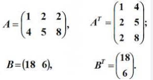

#### 2.算数运算

矩阵的加法和减法与多元组加法和减法类似。加法就是对每一行多元组求和得到。

矩阵的数乘，就是用数量与每个元素相乘。

#### 3.零矩阵

所有元素都为 0 的矩阵，称之为零矩阵。

#### 4.矩阵乘法

一个 m x n 的矩阵 A 和一个 n x r 的矩阵 B，它们的乘积 AB 是一个大小为 m x r 的矩阵 C，其中 Cij 为 A 的第 i 行和 B 的第 j 列的点积。

矩阵乘法不具备交换性，具有结合性和分配性。

- 结合性：ABC = A(BC)
- 分配性：A(B+C) = AB + AC

矩阵乘积的转置等于每个矩阵转置之积，只是次序相反。

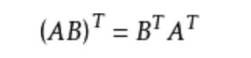

### 线性系统

#### 线性方程

线性方程就是一次方程：方程中各项只有一次和常数项。数学上习惯用未知数的个数称呼方程：一元、二元、三元线性方程（一次方程）。

线性方程的标准形式：

```
ax = c
ax1 + bx2 = c
ax1 + bx2 + cx3 = d
...
```

#### 两个未知数的线性系统

我们知道直线的方程就是有两个未知数的线性方程。

如果有两个这样的方程:

```
a1x + b1y = c1
a2x + b2y = c2
```

那么它们表示坐标系中的两条直线。它们之间可能的关系如下：

1. 两条直线相交一点，方程组有一个解。
2. 两条直线不相交，平行，方程组无解。
3. 两条直线重合，方程组有无数解。

如果只有一个解，我们可以用消元法来求解。

#### 一般线性系统

m x n 的线性方程系统一般形式：

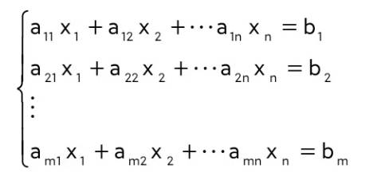

其中包含了如下几个矩阵：

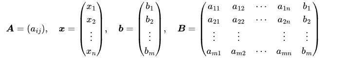

如果 b1 = b2 ... = bn = 0，那么线性方程系统称之为齐次系统。线性系统可以写成矩阵形式：AX = b

A 为系数矩阵，B 为增广矩阵，x 为未知数矩阵，b 为常数项矩阵。

### 方阵

m x n 的矩阵，如果 m = n，则它是一个方阵。

- 对角矩阵：对角线元素外的其他所有元素都为 0 的矩阵。
- 数量矩阵：一种特殊类型的对角矩阵，其对角线上的元素都相同。
- 单位矩阵：单位矩阵通常用 **I** 表示，左上角和右下角对角线的元素都为 1，其他元素都为 0 的矩阵。任何矩阵与单位矩阵相乘都等于原矩阵：`IM = MI = M`。
- 三角形矩阵：有上三角和下三角两种矩阵，表示除对角线之上或者之下的所有元素都为 0 的矩阵。

### 行列式(determinant)

在二维坐标系中，在原点处的 x 和 y 方向上的单位向量形成了一个闭合的正方形区域。矩阵 M 可以表示一个二维变换，变换后的闭合正方形区域的面积就是该矩阵 M 的行列式值。记作 `det(M)`。

矩阵 M：

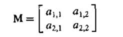

它的行列式：

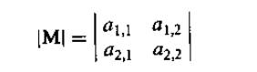

二阶和三阶行列式公式：

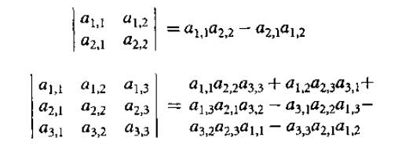

三阶行列式公式比较难记，有个简单的记法：

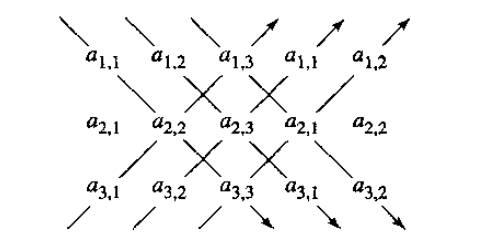

#### 一般行列式的计算方法

一般行列式的计算方法: 行列式的子式展开式。

子矩阵就是把一个矩阵的一行或者多行和一列或者多列删除后所得的矩阵。

子式就是子矩阵的行列式。

余子式：对于 M 的元素 aij，通过删除 M 的第 i 行和第 j 列得到的矩阵 M'ij 的行列式 detM，余子式 Cij 就是 detM 或者其相反数。

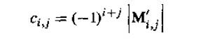

如果有一个 3x3 的矩阵，可以用如下基于余子式的方法计算行列式：

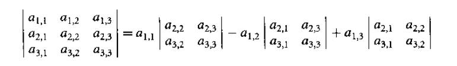

该公式可以扩充到一般任意阶的行列式计算方法。

#### 行列式的性质

- 矩阵的行列式等于其专职矩阵的行列式：|M| = |MT|
- 两个矩阵之积的行列式等于两个矩阵的行列式之积：|MM1| = |M||M1|
- 矩阵的逆矩阵的行列式等于矩阵行列式的倒数
- 单位矩阵行列式等于 1
- 交换矩阵 M 的任意两行（或列），将改变行列式 |M| 的符号
- 如果用常数 a 乘以 M 的任意行（或列）的所有元素，则行列式等于 a|M|
- 如果 M 的两行（或列）相同，则 |M|=0
- 三角形矩阵的行列式等于对角线上元素之积

### 逆矩阵

对于给定矩阵 M1，如果存在一个矩阵 M2，使得 M1 与 M2 的乘积为单位矩阵即 M1 * M2 = I，则 M1 和 M2 互为逆矩阵。

#### 性质

- M1 和 M2 的乘积的逆矩阵，等于 M2 的逆矩阵与 M1 的逆矩阵的乘积：(M1 * M2)^-1 = M2^-1 * M1^-1
- (M1^-1)^-1 = M1
- (aM)^-1 = (1/a)M^-1

#### 逆矩阵何时存在？

并不是所有矩阵都有与之对应的逆矩阵。可以通过下面的方式确定一个 nxn 矩阵是否包含逆矩阵。

1. 矩阵的秩为 n。
2. 它是非奇异的。
3. 矩阵的行列式值不等于 0，|M| != 0。
4. 如果以该矩阵作为一个变换，它不会减少变换后空间的维数。

#### 奇异矩阵

如果矩阵 M 是一个方阵，并且它的行列式值非 0，则称矩阵 M 是非奇异（nonsingular）的，否则矩阵就是奇异的（singular）。

非奇异矩阵的性质：

1. |M| != 0
2. 秩为 n
3. 存在逆矩阵
4. 齐次系统 MX = 0，仅有一个简单解 X = 0

### 线性空间

#### 数域

数域：是一个代数系统，对其中的元素执行加、减、乘、除（被零除外）运算所得的结果依然属于该系统，并且具有结合律，交换律和分配律。

常见的数域有：
- 有理数 Q={a/b, b 属于 Z, b != 0}, Z 表示整数
- 实数 R
- 复数 C

#### 定义

线性空间与数域性质类似，线性空间包含一组对象（向量）、实数（数量）和两种运算（向量相加和向量与数相乘）。形式上具有：
- 一个数域 K（一般就是实数）
- 一个（非空）向量集 V
- 加法封闭性：线性空间中任意两个向量相加，结果仍然属于线性空间
- 数乘封闭性：线性空间中任意向量与数相乘，结果仍然属于线性空间

#### 子空间

给定 R 上的线性空间 V，设 S 为 V 的子集，并设 S 和 V 的运算相同，如果 S 也是 R 上的线性空间，则 S 是 V 的子空间。

子空间不满足以下性质：
- 加法封闭性：子空间中两个向量相加，可能结果不属于子空间
- 数乘封闭性：子空间中向量与数相乘，可能结果不属于子空间

#### 线性组合和生成空间

线性组合由向量与数的数乘之和组成，假设有向量集 `{a1, a2, a3,...,an}`, 可以生成向量 `u = k1a1 + k2a2 + ... + knan`。向量 u 就是一个线性组合。

给定一个向量集合 `{a1, a2,..., an}`, 它定义了一个线性空间 V，向量的所有线性组合的集合 S 本身就是一个线性空间，并且该空间是由 `{a1, a2,..., an}` 生成（spanned）的空间，集合 `{a1, a2,..., an}` 叫做 S 的生成集合。任何线性空间 S 中的向量都可以用 `{a1, a2,..., an}` 的线性组合来表示。

#### 线性无关、维数、基底

1、线性无关

假设有一个向量空间 V,对于任何向量集合 `{v1, v2, v3, ..., vn}`，如果存在不全为 0 的常数 `c1,c2,c3,...,cn`, 使得
```
c1v1 + c2v2 + c3v3 + ... + cnvn = 0（零向量）
```
则称该向量集合定义为线性相关的，而如果仅当 `c1,c2,c3...,cn` 所有都为 0 时等式才成立，则成该向量集时线性无关的。

上面的定义不太直观，更为直观的解释：当且仅当任何向量都不是其他向量的线性组合时，向量集合 `{v1, v2, v3, ..., vn}` 中的非零向量才是线性无关的。

三维笛卡尔坐标系中 x、y、z 轴上的三个单位向量就是线性无关的。

2、基底和维数

线性空间 V 中，如果有向量集合 {v1,v2,...,vn}，当且仅当它们是线性无关的，并生成该空间时，它们将构成线性空间 V 的一个基底，V 的维数为 n，即线性无关的向量的个数。

#### 线性映射

线性映射 T： A -> B 是一个保留向量加法和数乘的函数：
- 任意向量 u,v 属于向量空间 A，T(u + v) = T(u) + T(v)
- 任意实数 a，向量 u 属于向量空间 A，T(au) = aT(u)

线性映射 T，对应的矩阵变换叫做线性变换。

#### 克莱姆定理

如果线性方程组系统有一个解，则克莱姆定理是直接求解的一种方法。假设有如下方程组：


它的解为：

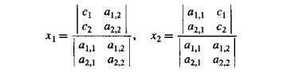

克莱木定理一般形式如下，设 A 表示系数矩阵 `A = A[i, j]`，并设 Bi 为常数 c1,c2,...,cn 替换 A 的第 i 列所得的矩阵，那么，如果矩阵 A 的行列式 |A| 不等于 0，则存在唯一解：


#### 特征值（eigenvalue）和特征向量（eigenvector）

矩阵乘以一个向量，可以被认为是变换向量的方向和长度。对于某些特殊的向量 v，可以找到一个常数 a，使得
```
Mv = av
```

则 a 叫做矩阵 M 的特征值，v 叫做矩阵 M 的特征向量。av 就是 v 的一个缩放版本，所以 M 对 v 的作用只不过是缩放。

## C3.向量代数

### 基础运算：加法、减法、数乘

a、b为任意实数，u、v、w 是向量：

- 加法交换性：u + v = v + u
- 加法结合性：u + v + w = u + (v + w)
- 乘法对加法的分配性：(a + b)u = au + bu
- 加法对乘法的分配性：a(u + v) = au + av

### 向量空间

#### 线性变换

如果有两个集合 D 和 R，那么可以定义一种操作来将 D 中的每一个元素映射到 R 中的一个元素，我们称这种对应操作为为函数、变换或者映射。集合 D 叫做定义域，集合 R 叫做值域。

线性变换：从一个线性（向量）空间映射到另一个线性空间的变换。一般，线性空间 U 到 线性空间 V 的变换记作 T: U -> V，有如下性质(a 为实数，u、v 为向量)：
- T(u + v) = T(u) + T(v)
- T(au) = aT(u)

所以线性变换的性质就是保持线性组合，即总是把直线映射成直线，零向量映射成零向量。所有向量空间 V 中的向量都可以用 V 的基底向量 {v1, v2,..., vn} 表示（线性组合）。因此线性变换的性质可以通过对基底向量的操作结果来描述。

剪切变换：一种特殊的线性变化，只缩放基底向量中的一个。

### 仿射空间

一个放射空间 A 有一个点集 P 和一个向量集 V 所构成，它是由一些基底想浪或者 V 的基所生成的向量空间。A 的维数就是 V 的维数。所以仿射空间就是将点集与向量空间合并的一个概念。

仿射空间中任意两点，都存在一个向量丛其中一个点指向另一个点。

- 两个向量相加得到第三个向量
- 一个向量与标量相乘得到一个向量
- 一个向量与点相加得到一个新的点
- 两个向量相减得到一个向量
- 两个点相减得到一个向量

### 欧几里得空间

在仿射空间中并没有提及原点，角度和长度等，因为它并不关系这些概念，因为很多时候，我们只关心点之间的相对关系。而欧几里得空间就是在仿射空间的基础上增加了原点，会讨论原点，角度和长度这些概念。

#### 数量积（点积，Dot Product）

向量 u 和 v 的点积为向量 u 和 v 的模长的乘积乘以向量 u 和 v 之间的夹角的余弦值。

另有公式：`(x1, y1, z1)(x2, y2, z2) = x1*x2 + y1*y2 + z1*z2`。

所以可以用向量的点积计算两个向量之间的夹角。

#### 向量积（叉积）

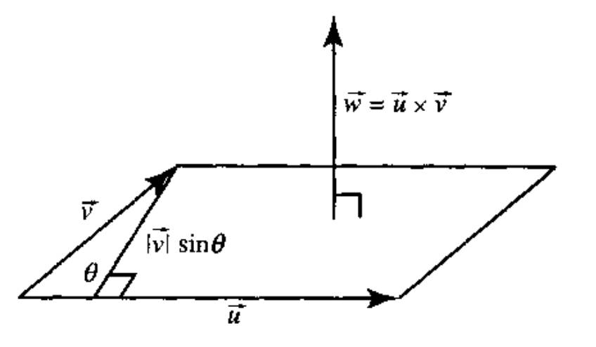

两个向量 u 和 v 的向量积的定义：
- 的叉积是一个向量：w = u x v
- 叉积结果垂直于两个向量 u 和 v
- 结果向量 w 的长度，等于向量 u 和 v 构成的平行四边形面积大小：w = u x v = |u||v|sin(a)，a 为 向量 u 和 v 的夹角。

#### 数量三重积（混合积，标量三重积）

混合积的定义，已知三维向量 u、v、w，定义运算如下：
```
[u,v,w] = (u x v) · w
```

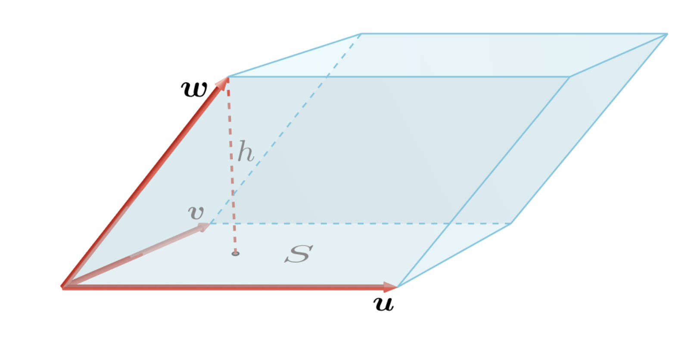

混合积定义了如图所示的平行六面体的体积。

该有向体的体积可通过混合积计算出来，叉积 S = u x v。W 在 S 上的投影就是 h，如下所示。

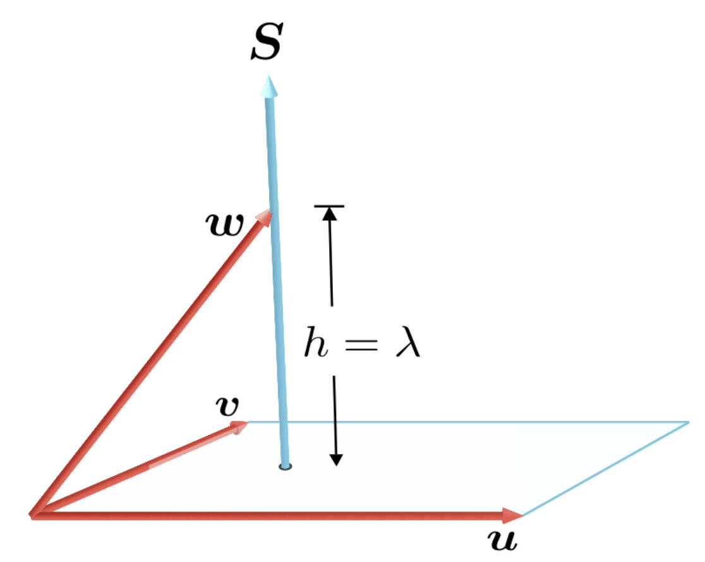

结合叉积和点积的几何意义，所以混合积的意思为：

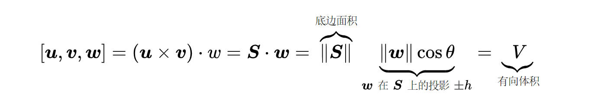

混合积可以表示为三阶行列式：

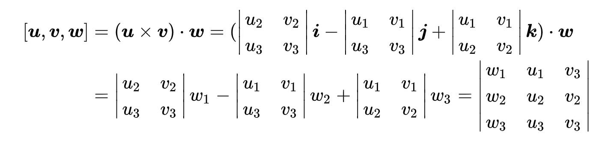

当 u、v、w 共面时，体积为 0，所以混合积结果为 0。
