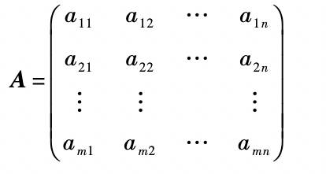

# 《Cometric Tools for Computer Graphics》读书笔记

## C1.绪论

1.浮点数屏蔽问题

非负浮点数求和应该按从小到大的顺序进行，以避免大数屏蔽小数。

## C2.矩阵和线性系统

### 多元组

多元组本质上就是一个元素的有序序列，n 个元素的多元组称为 n 维多元组，并用下标来标记：`a = (a1, a2, ..., an)`。

多元组的相加（或相减，相乘，相除）可以简单地将它们对应的元素相加（或相减，相乘，相除）实现。

多元组的乘法，就是将每一项相乘后求和。结果是一个数，所以叫做**数量积**，也叫做**点积**。两个多元组 **a** 和 **b** 的点积记作 **a·b**。具有以下性质：

- 交换性：a·b = b·a
- 结合性：(ka)·b = k(a·b)
- 分配性：a·(b + c) = a·b + a·c

### 矩阵

矩阵用大写粗体字母表示，用 "m 行 n 列" 来说明矩阵的大小，表示为 m x n。如果 m = n，则矩阵为方阵。



#### 1.转置矩阵（transpose of matrix）

转置矩阵的生成方式：将 M 的 m 行作为新矩阵的列，将 n 列作为新矩阵的行。


#### 2.算数运算

矩阵的加法和减法与多元组加法和减法类似。加法就是对每一行多元组求和得到。

矩阵的数乘，就是用数量与每个元素相乘。

#### 3.零矩阵

所有元素都为 0 的矩阵，称之为零矩阵。

#### 4.矩阵乘法

一个 m x n 的矩阵 A 和一个 n x r 的矩阵 B，它们的乘积 AB 是一个大小为 m x r 的矩阵 C，其中 Cij 为 A 的第 i 行和 B 的第 j 列的点积。

矩阵乘法不具备交换性，具有结合性和分配性。

- 结合性：ABC = A(BC)
- 分配性：A(B+C) = AB + AC

矩阵乘积的转置等于每个矩阵转置之积，只是次序相反。


### 线性系统

#### 线性方程

线性方程就是一次方程：方程中各项只有一次和常数项。数学上习惯用未知数的个数称呼方程：一元、二元、三元线性方程（一次方程）。

线性方程的标准形式：

```
ax = c
ax1 + bx2 = c
ax1 + bx2 + cx3 = d
...
```

#### 两个未知数的线性系统

我们知道直线的方程就是有两个未知数的线性方程。

如果有两个这样的方程:

```
a1x + b1y = c1
a2x + b2y = c2
```

那么它们表示坐标系中的两条直线。它们之间可能的关系如下：

1. 两条直线相交一点，方程组有一个解。
2. 两条直线不相交，平行，方程组无解。
3. 两条直线重合，方程组有无数解。

如果只有一个解，我们可以用消元法来求解。

#### 一般线性系统

m x n 的线性方程系统一般形式：


其中包含了如下几个矩阵：


如果 b1 = b2 ... = bn = 0，那么线性方程系统称之为齐次系统。线性系统可以写成矩阵形式：AX = b

A 为系数矩阵，B 为增广矩阵，x 为未知数矩阵，b 为常数项矩阵。

### 方阵

m x n 的矩阵，如果 m = n，则它是一个方阵。

- 对角矩阵：对角线元素外的其他所有元素都为 0 的矩阵。
- 数量矩阵：一种特殊类型的对角矩阵，其对角线上的元素都相同。
- 单位矩阵：单位矩阵通常用 **I** 表示，左上角和右下角对角线的元素都为 1，其他元素都为 0 的矩阵。任何矩阵与单位矩阵相乘都等于原矩阵：`IM = MI = M`。
- 三角形矩阵：有上三角和下三角两种矩阵，表示除对角线之上或者之下的所有元素都为 0 的矩阵。

### 行列式(determinant)

在二维坐标系中，在原点处的 x 和 y 方向上的单位向量形成了一个闭合的正方形区域。矩阵 M 可以表示一个二维变换，变换后的闭合正方形区域的面积就是该矩阵 M 的行列式值。记作 `det(M)`。

矩阵 M：


它的行列式：


二阶和三阶行列式公式：


三阶行列式公式比较难记，有个简单的记法：


#### 一般行列式的计算方法

一般行列式的计算方法: 行列式的子式展开式。

子矩阵就是把一个矩阵的一行或者多行和一列或者多列删除后所得的矩阵。

子式就是子矩阵的行列式。

余子式：对于 M 的元素 aij，通过删除 M 的第 i 行和第 j 列得到的矩阵 M'ij 的行列式 detM，余子式 Cij 就是 detM 或者其相反数。


如果有一个 3x3 的矩阵，可以用如下基于余子式的方法计算行列式：


该公式可以扩充到一般任意阶的行列式计算方法。

#### 行列式的性质

- 矩阵的行列式等于其专职矩阵的行列式：|M| = |MT|
- 两个矩阵之积的行列式等于两个矩阵的行列式之积：|MM1| = |M||M1|
- 矩阵的逆矩阵的行列式等于矩阵行列式的倒数
- 单位矩阵行列式等于 1
- 交换矩阵 M 的任意两行（或列），将改变行列式 |M| 的符号
- 如果用常数 a 乘以 M 的任意行（或列）的所有元素，则行列式等于 a|M|
- 如果 M 的两行（或列）相同，则 |M|=0
- 三角形矩阵的行列式等于对角线上元素之积

### 逆矩阵

对于给定矩阵 M1，如果存在一个矩阵 M2，使得 M1 与 M2 的乘积为单位矩阵即 M1 * M2 = I，则 M1 和 M2 互为逆矩阵。

#### 性质

- M1 和 M2 的乘积的逆矩阵，等于 M2 的逆矩阵与 M1 的逆矩阵的乘积：(M1 * M2)^-1 = M2^-1 * M1^-1
- (M1^-1)^-1 = M1
- (aM)^-1 = (1/a)M^-1

#### 逆矩阵何时存在？

并不是所有矩阵都有与之对应的逆矩阵。可以通过下面的方式确定一个 nxn 矩阵是否包含逆矩阵。

1. 矩阵的秩为 n。
2. 它是非奇异的。
3. 矩阵的行列式值不等于 0，|M| != 0。
4. 如果以该矩阵作为一个变换，它不会减少变换后空间的维数。

#### 奇异矩阵

如果矩阵 M 是一个方阵，并且它的行列式值非 0，则称矩阵 M 是非奇异（nonsingular）的，否则矩阵就是奇异的（singular）。

非奇异矩阵的性质：

1. |M| != 0
2. 秩为 n
3. 存在逆矩阵
4. 齐次系统 MX = 0，仅有一个简单解 X = 0

### 线性空间

#### 数域

数域：是一个代数系统，对其中的元素执行加、减、乘、除（被零除外）运算所得的结果依然属于该系统，并且具有结合律，交换律和分配律。

常见的数域有：
- 有理数 Q={a/b, b 属于 Z, b != 0}, Z 表示整数
- 实数 R
- 复数 C

#### 定义

线性空间与数域性质类似，线性空间包含一组对象（向量）、实数（数量）和两种运算（向量相加和向量与数相乘）。形式上具有：
- 一个数域 K（一般就是实数）
- 一个（非空）向量集 V
- 加法封闭性：线性空间中任意两个向量相加，结果仍然属于线性空间
- 数乘封闭性：线性空间中任意向量与数相乘，结果仍然属于线性空间

#### 子空间

给定 R 上的线性空间 V，设 S 为 V 的子集，并设 S 和 V 的运算相同，如果 S 也是 R 上的线性空间，则 S 是 V 的子空间。

子空间不满足以下性质：
- 加法封闭性：子空间中两个向量相加，可能结果不属于子空间
- 数乘封闭性：子空间中向量与数相乘，可能结果不属于子空间

#### 线性组合和生成空间

线性组合由向量与数的数乘之和组成，假设有向量集 `{a1, a2, a3,...,an}`, 可以生成向量 `u = k1a1 + k2a2 + ... + knan`。向量 u 就是一个线性组合。

给定一个向量集合 `{a1, a2,..., an}`, 它定义了一个线性空间 V，向量的所有线性组合的集合 S 本身就是一个线性空间，并且该空间是由 `{a1, a2,..., an}` 生成（spanned）的空间，集合 `{a1, a2,..., an}` 叫做 S 的生成集合。任何线性空间 S 中的向量都可以用 `{a1, a2,..., an}` 的线性组合来表示。

#### 线性无关、维数、基底

1、线性无关

假设有一个向量空间 V,对于任何向量集合 `{v1, v2, v3, ..., vn}`，如果存在不全为 0 的常数 `c1,c2,c3,...,cn`, 使得
```
c1v1 + c2v2 + c3v3 + ... + cnvn = 0（零向量）
```
则称该向量集合定义为线性相关的，而如果仅当 `c1,c2,c3...,cn` 所有都为 0 时等式才成立，则成该向量集时线性无关的。

上面的定义不太直观，更为直观的解释：当且仅当任何向量都不是其他向量的线性组合时，向量集合 `{v1, v2, v3, ..., vn}` 中的非零向量才是线性无关的。

三维笛卡尔坐标系中 x、y、z 轴上的三个单位向量就是线性无关的。

2、基底和维数

线性空间 V 中，如果有向量集合 {v1,v2,...,vn}，当且仅当它们是线性无关的，并生成该空间时，它们将构成线性空间 V 的一个基底，V 的维数为 n，即线性无关的向量的个数。


